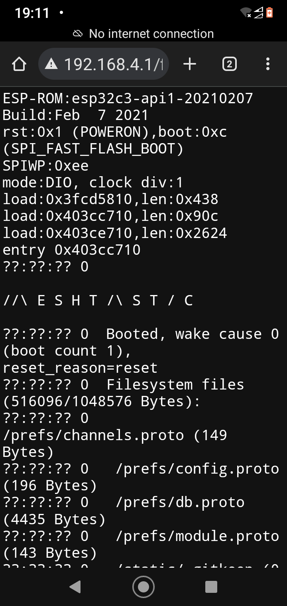
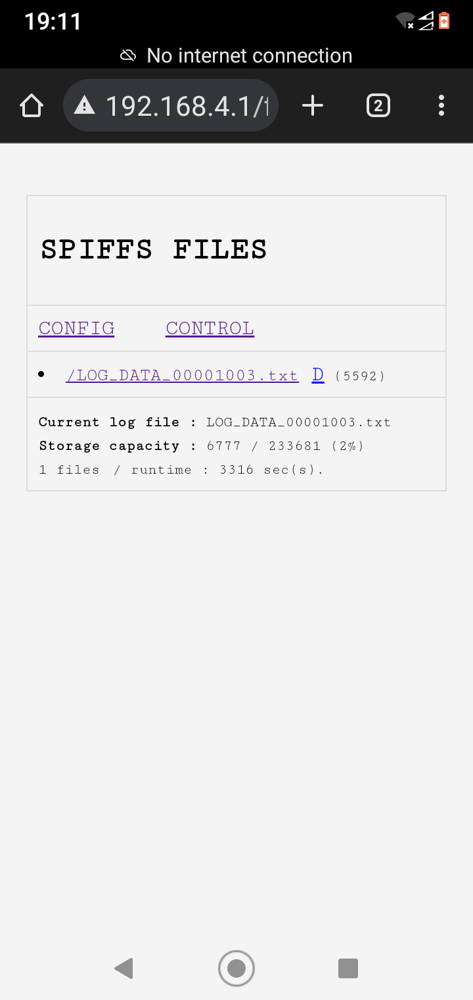
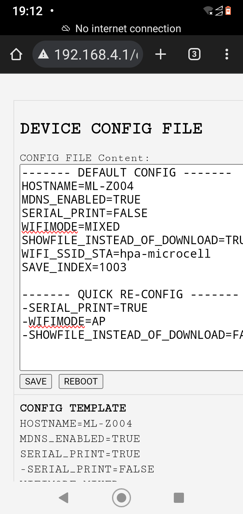
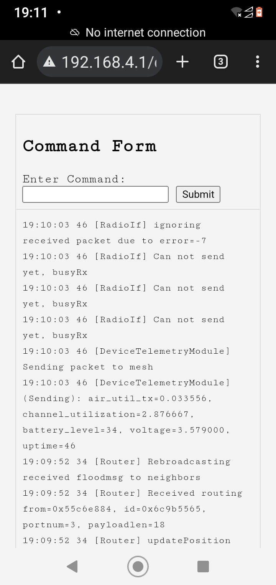

# ESPLogLite – A lightweight log recorder designed to streamline logging for Meshtastic nodes.
This project is intended as an alternative to the OpenLog device, especially useful when deploying Meshtastic devices in hard-to-reach locations. While OpenLog offers significantly larger storage capacity and is widely used in various applications, the ESP01 logger provides the benefit of near real-time log monitoring via WiFi. This allows you to access recent logs without physical access to the device. Note that the ESP01 logger has a smaller storage capacity (up to approximately 48 hours of logs) due to the limitations of internal flash memory, and it consumes an additional 10mA, which could be a constraint if you're using solar panels for power. Therefore, it is recommended for scenarios where instant data access is prioritized over longer-term storage.
  

## Key Features:
 - **Instant WiFi Connection**: Supports three modes—Access Point (when not
part of a wider WiFi infrastructure), Station (connects as another device in your existing WiFi network), and Mixed (AP & Station mode simultaneously).  
 - **Configurable via WiFi/Serial**: You can easily adjust settings like serial speed and hostname over WiFi or through the serial interface.
 - **Easy Integration**: Uses the same power supply as the Meshtastic device, requiring only four connections—VCC, GND, TX, and RX.
 - **Automatic Log Management**: Due to limited storage capacity, older log entries are automatically deleted to make space for new data, ensuring recent logs are always available.
 - **Self-Recovery**: Built-in mechanisms for hardware or software recovery in the event of issues like corrupted filesystems.
 - **Energy Saving Mode**: Can be remotely suspended to save energy, though manual reset is required to reactivate.

## Gallery
The screenshots below show the logger interface and its key features: 
- **LOG Files**: Displays files containing the most recent log records from the Meshtastic node via the serial port. Each file holds approximately 2000 lines of logs (configurable). When storage reaches 90% capacity, the oldest file is automatically deleted to free space on the SPIFFS filesystem. Users can also manually delete unnecessary files by clicking the "D" hyperlink next to the file name. 

- **CONFIG Page** : Allows easy configuration of the logger by modifying the internal configuration file. Users can adjust settings such as serial speed, WiFi mode, and hostname. 

- **CONTROL Page**: Provides additional device control for advanced users, enabling deeper management and customization of the logger's behavior. This page is intended for experienced users who require fine-tuned control over the device's operation. 

## Miscellaneous Information
WiFi **credentials are stored in an encoded form** for added security. For example, instead of storing the default password string "nimda," an encoded string like "fG5pbWRhfA==" is saved. This encoding uses BASE64. To encode your own WiFi password, you can use a tool or prompt ChatGPT like "encode password |nimda| using BASE64." Do not forget to wrap the password into two | (pines).
In the event of a logger error or unrecoverable corruption of the SPIFFS filesystem, the device will automatically restart and format SPIFFS. All configuration and log data will be lost, but a default config file (which can be modified in the source code) will be deployed. The logger will continue recording logs from the UART after recovery.

## DISCLAIMER
This solution is a side-product of my hobby activity exploring the Meshtastic network and its potential as a transport network for IoT devices in remote locations. The intention was not to create a polished, commercial-grade product, but rather to combine and tweak existing code to enable continuous, remote monitoring of multiple devices. I am sure there are many improvements that can be made to enhance this project. Feel free to take the code and build upon it—whether for your own projects or by contributing back and sharing your changes with others who may be interested. Collaboration is welcome!
